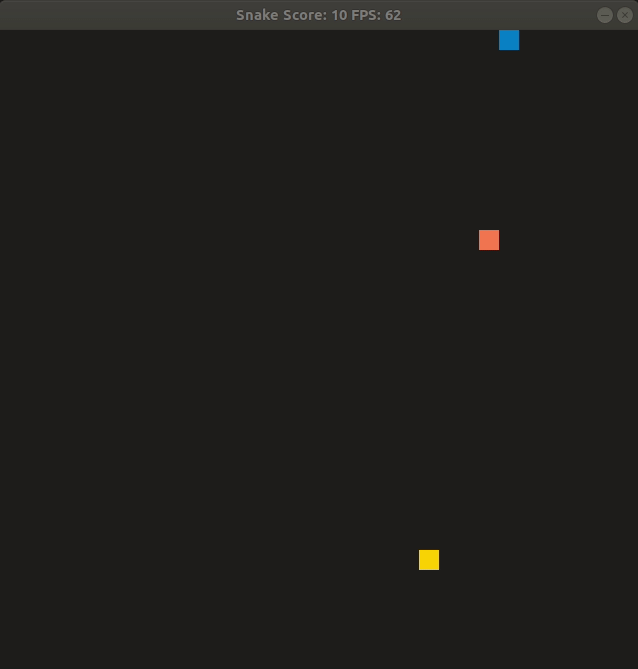

# CPPND: Capstone Snake Game Example

This is the Repo for a Clasic Arcade Snake Game Code. The Game is designed using the Game Loop design pattern and several C++ features (as RAII or smart pointers).
The Game can be run by the user or the user can watch a Simple AI play the game.

## Dependencies for Running Locally
* cmake >= 3.7
  * All OSes: [click here for installation instructions](https://cmake.org/install/)
* make >= 4.1 (Linux, Mac), 3.81 (Windows)
  * Linux: make is installed by default on most Linux distros
  * Mac: [install Xcode command line tools to get make](https://developer.apple.com/xcode/features/)
  * Windows: [Click here for installation instructions](http://gnuwin32.sourceforge.net/packages/make.htm)
* SDL2 >= 2.0
  * All installation instructions can be found [here](https://wiki.libsdl.org/Installation)
  >Note that for Linux, an `apt` or `apt-get` installation is preferred to building from source. 
* gcc/g++ >= 5.4
  * Linux: gcc / g++ is installed by default on most Linux distros
  * Mac: same deal as make - [install Xcode command line tools](https://developer.apple.com/xcode/features/)
  * Windows: recommend using [MinGW](http://www.mingw.org/)

## Basic Build Instructions

1. Clone this repo.
2. Make a build directory in the top level directory: `mkdir build && cd build`
3. Compile: `cmake .. && make`
4. Run it: `./SnakeGame`.

## Functionality

My goal was to recreate the classic feature of Snake games:

1-You scores when you eat a fruit but your velocity increase as well as your size, then the game become more difficult.
2-If you eat yourself, you loose
3-Sometimes special fruits appear that increment a lot your score without increasing your speed or your size.

Additionaly a Simple AI can run this game, based in a very simple Heuristic.